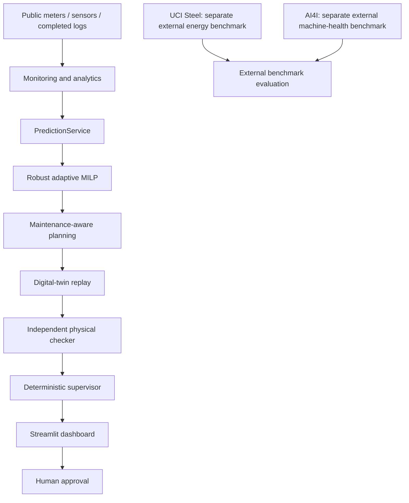

# Smart Industrial Energy Copilot

A digital-twin-backed industrial energy decision-support system that predicts plant behaviour, optimizes production and maintenance schedules, independently verifies recommendations through physical replay, and presents checked decisions to the operator.

**ML predicts. MILP decides. Digital twin verifies. Human approves.**

Built for Schneider Electric Challenge 04 around a **simulated SME steel reference plant**. The released runtime uses deterministic services and the G0 supervisor. A live LLM, API credentials and autonomous plant control are not required.

## Contents

- [What it does](#what-it-does)
- [System architecture](#system-architecture)
- [Reference plant](#reference-plant)
- [Key results](#key-results)
- [Demo](#demo)
- [Quick start](#quick-start)
- [Repository structure](#repository-structure)
- [Technical pipeline](#technical-pipeline)
- [Data and models](#data-and-models)
- [Reproducibility](#reproducibility)
- [Tests](#tests)
- [Limitations](#limitations)
- [Deployment pathway](#deployment-pathway)
- [License / citation](#license--citation)


## What it does

The deterministic v1.0 prototype helps an operator **see** plant condition, **predict** energy/duration/load/health, **plan** robust schedules, **prove** them through independent replay, and **approve** verified recommendations. It withholds failed plans. A live LLM is not required.

## Why this problem matters

An SME steel plant must meet production while managing furnace electricity, thermal processes, stock, utilities and equipment availability. Cheaper tariff windows do not necessarily reduce energy; a mathematically feasible forecast schedule may still fail under physical replay. This project makes both distinctions visible.

| Operator question | System response |
|---|---|
| **SEE:** Is anything requiring attention? | Plant state, public measurements, asset accounting, production, inventory and observable diagnostics. |
| **PREDICT:** What might operation require? | Independent heat-energy, duration, AUX-load and health predictions with uncertainty. |
| **ACT:** Is there a better plan? | Constraint-aware MILP scheduling, robustness reserves and remaining-horizon replanning. |
| **PROVE:** Does the plan survive execution? | Matched-condition digital-twin replay and independent physical checks. |
| **APPROVE:** Should it be accepted? | Explicit operator review, approval/rejection/defer controls and an audit trail. |

## System architecture



| Component | Responsibility |
|---|---|
| Digital twin | Generate physical material, energy, equipment and observation state. |
| Analytics | Reconcile accounting and construct posting-time features and diagnostics. |
| PredictionService | Predict energy, duration, AUX load and 24-hour machine-health risk. |
| MILP / robust controller | Choose candidate decisions under configured constraints and uncertainty assumptions. |
| Maintenance controller | Apply frozen eligibility policy and synthetic service semantics. |
| Replay / independent checker | Accept or reject candidate physical execution. |
| G0 supervisor | Orchestrate typed tools, escalate failures and construct grounded recommendations. |
| Dashboard | Present evidence and record explicit operator feedback. |

The supervisor cannot rewrite models, thresholds, constraints or simulator physics. External benchmarks remain separate experiments, as shown in the diagram.

## Reference plant

SIMULATED SME steel reference plant: induction furnace → caster → billet yard → reheating furnace → rolling mill, supported by cooling pump, compressor and AUX. The shared clock is 15 minutes; hard constraints include 7,000 kVA contract demand, 0–200 t stock, process yields and cooling interlock. Technical values and assumptions remain versioned in [plant_v1.yaml](configs/plant_v1.yaml) and the [assumption register](reports/assumption_register.md).

| Asset | Role |
|---|---|
| IF_01 | Induction-furnace melting and heat production |
| Caster | Liquid-to-billet production with configured yield |
| Billet yard | Intermediate material stock, bounded at 0–200 t |
| RHF_01 | Billet reheating under configured process requirements |
| MILL_01 | Rolling billets into bars subject to capacity and yield |
| PMP_01 | Cooling pump; required whenever IF is powered |
| CMP_01 / AUX | Compressor and auxiliary plant loads |
| MAIN | Aggregate plant electricity accounting |

The initial MILP horizon is **24 hours / 96 slots**. Checks cover non-overlapping heats, working windows, material and energy balances, production order, rolling availability, stock, cooling and demand. The optimizer uses documented reduced-order allocation and permitted operating choices; it does not independently solve detailed furnace thermal physics. Physical replay remains authoritative.

## Key capabilities

- Time-aware monitoring, heat/asset accounting and observable diagnostics.
- Independent energy, duration, AUX-load and machine-health predictors.
- Robust/adaptive MILP scheduling and bounded synthetic preventive maintenance.
- Matched-condition replay and independent acceptance gates.
- Provenance-backed operator recommendations, explicit approval and retained rejection evidence.

## Key results

These are **reduced-order simulation results**, not field savings or industrial reliability evidence.

| Purpose | Frozen evidence | Interpretation |
|---|---|---|
| Energy / tariff example | ~2.44% lower simulated electricity; ~4.21% lower synthetic tariff cost; production maintained | DIGITAL-TWIN-REALIZED, SYNTHETIC-PRACTICE, SYNTHETIC-TARIFF; [Phase II-D](reports/phase2d_replay_summary.md) |
| Robust scheduling | Original central scheduler 0/10 feasible; robust adaptive scheduler 10/10 | Held-out digital-twin evaluation, not a safety guarantee; [Phase II-E](reports/phase2e_summary.md) |
| Maintenance | 16 services; 14 strict matched avoided failures; 0 unnecessary within 24 h; 2 undetermined | SYNTHETIC-MAINTENANCE; final F0 feasibility **91.67%**, F2 **87.50%**; [Phase II-F](reports/phase2f_summary.md) |
| Supervisor | 81 scripted deterministic cases; 100% expected safe handling; 0 false verified recommendations | G0 qualified offline; live LLM evaluation is pending and not required for v1; [Phase II-G](reports/phase2g_summary.md) |

Maintenance reduced represented equipment failures but did **not** improve final scheduling feasibility. Heat-duration/scheduling limitations remain. Unlike benefits are reported separately. Exact deck metrics and their source hashes are in [dashboard_deck_metrics.json](dashboard_deck_metrics.json).

### Reading the results correctly

The Phase II-D example includes a declared synthetic practice intervention. It is not a universal scheduling-only energy reduction. Moving the same electricity into cheaper periods reduces tariff exposure without necessarily reducing kWh. Synthetic tariff cost is not an industrial bill with demand charges or other billing components.

The Phase II-E comparison uses frozen final seeds **201–210** and demonstrates the combined robust/adaptive policy. It does not isolate the causal effect of a single buffer or establish a safety guarantee.

The final maintenance experiment retained **24 predeclared seed/day cases per strategy**, including unsuccessful continuations:

| Final outcome | F0: no preventive maintenance | F2: maintenance-aware |
|---|---:|---:|
| Accepted full-day cases | 22 / 24 | 21 / 24 |
| Feasibility / production completion | 91.67% | 87.50% |

F1 is an advisory-only control with the same physical outcomes as F0. F2's final feasibility difference was **−4.17 percentage points**. Its 16 executed services comprised six MILL and ten PMP services. An earlier planned recommendation is not a performed service.

For the **21 matched pairs where both full physical replays were accepted**:

- Mean paired electricity change: **−0.0331%**; IF SEC unchanged.
- Mean paired synthetic tariff-cost change: **+0.0075%**.
- Summed corrective asset downtime: **2.7246 hours → 0 hours**.
- Summed preventive asset downtime: **0 hours → 3.5000 hours**.
- Summed total asset downtime: **2.7246 hours → 3.5000 hours**.

Across all attempts, 4.00 preventive asset-hours were acknowledged; 3.50 had accepted full-day evidence. Asset-hour sums are not necessarily wall-clock plant downtime. Service-relative 24-hour attribution and calendar-day failure counts cover different windows. Two avoided-failure attribution cases remained undetermined; failed counterfactuals were not counted as avoided failures. Details: [maintenance attribution](reports/phase2f_maintenance_attribution.md).

The supervisor's 81 cases cover replay failures, computation limits, invalid inputs, maintenance, approval boundaries and adversarial text. These are scripted software benchmarks, not field operator trials or qualified live LLM results.

## Demo

Default **DEMO MODE** loads frozen, labelled precomputed evidence without training, internet or API keys. Seven pages: Overview, Energy, Optimise, Maintenance, Decision Center, Impact, Evidence / Audit. Four coherent cases: normal optimization, maintenance warning, replay rejection, adaptive recovery. VERIFIED is not APPROVED; failed plans cannot be approved.


Three-minute path: **Overview → Energy → Optimise → Replay rejection → Adaptive recovery / Decision Center → Maintenance → Impact**. [Demo script](reports/phase3a_demo_script.md). Live simulation is an explicit, heavier action and requires the complete qualified scientific archive; the lightweight checkout is optimized for offline Demo Mode. [Details](docs/REPRODUCIBILITY.md).

### Pages and scenarios

| Page | Operator purpose |
|---|---|
| Overview | KPIs, load, energy contribution, heat performance and current recommendation |
| Energy | Demand, asset electricity, SEC and expected-versus-actual diagnostics |
| Optimise | Reference/selected timelines, tariff context, predictions and replay status |
| Maintenance | MILL/PMP 24-hour risk, observable condition, eligibility and service windows |
| Decision Center | Canonical DecisionPacket, verification chain and explicit feedback |
| Impact | Separate energy, tariff, production, scheduling and reliability results |
| Evidence / Audit | Source IDs, versions, config hashes and approval provenance |

| Demo selection | Frozen case | Story |
|---|---|---|
| Normal optimization | Seed 3003 / day 28 | Accepted recommendation ready for human review |
| Maintenance warning | Seed 3002 / day 14 | Elevated risk and a considered service do not override rejection |
| Replay rejection | Seed 3001 / day 7, initial rejected plan | Forecast-feasible candidate fails duration checks; recommendation withheld |
| Adaptive recovery | Seed 3001 / day 7, recovery evidence | Bounded deterministic replanning produces a checked alternative |

Every selection loads one coherent bundle. Failed cases do not borrow successful traces from another seed. The reference timeline is prior observed operation from the same run, not a matched savings counterfactual. Historical impact cards identify their separate evidence populations.

Demo navigation never runs heavy optimization or replay. Reset creates a fresh review session without modifying frozen artifacts. Live Mode shows actual backend stages and requires the full qualified archive; missing protected inputs fail closed rather than producing fake solver progress.

### Verification and human approval

**VERIFIED** requires optimizer feasibility, accepted digital-twin replay and independent checker PASS. **APPROVED** additionally requires explicit operator confirmation and an audit record. Rejection is retained; defer does not confer approval.

An unverified plan cannot be approved for execution. Dashboard execution is disabled, and no UI controls operate real machinery. Prototype operator identity is not production authentication.

Failure states include no verified recommendation, replay/checker failure, stale or invalid data and computation limit. A solver limit means no accepted continuation was obtained within the configured limit; it is not proof that no feasible plan exists.

## Quick start

Use Python **3.12**, the qualified interpreter. Run from the repository root. These commands install the lightweight offline-evidence demo; they do not regenerate scientific experiments.

### Windows PowerShell

Using the environment executable directly avoids shell activation-policy issues:

```powershell
git clone https://github.com/preyash309/smart-industrial-energy-copilot.git
cd smart-industrial-energy-copilot
py -3.12 -m venv .venv
.venv\Scripts\python.exe -m pip install -r requirements-demo.txt
.venv\Scripts\python.exe scripts/verify_release.py
.venv\Scripts\python.exe -m streamlit run dashboard/app.py
```

If the Windows launcher is unavailable, replace `py -3.12` with your Python 3.12 executable path.

### Linux / macOS

```sh
git clone https://github.com/preyash309/smart-industrial-energy-copilot.git
cd smart-industrial-energy-copilot
python3.12 -m venv .venv
.venv/bin/python -m pip install -r requirements-demo.txt
.venv/bin/python scripts/verify_release.py
.venv/bin/python -m streamlit run dashboard/app.py
```

Open the localhost URL printed by Streamlit. Default startup is Demo Mode. **No real machinery control, authentication or live LLM is included.**

If port 8501 is occupied, add `--server.port 8502`. Initial installation needs package access or a wheel cache; subsequent Demo Mode use needs no internet connection.

| Dependency tier | Purpose |
|---|---|
| [requirements-demo.txt](requirements-demo.txt) | Dashboard and lightweight evidence consumption |
| [requirements-dev.txt](requirements-dev.txt) | Demo dependencies plus test/development tools |
| [requirements-full.txt](requirements-full.txt) | Pinned simulator, prediction, MILP and replay environment |

Use **separate environments** for dashboard and full scientific reproduction. Their qualified numerical-library versions differ; do not merge or upgrade them casually.

## Repository structure

```text
configs/                    versioned plant, model, scheduling and supervisor contracts
src/energy_copilot/          sim, analytics, forecast, optimization, replay, robust,
                            maintenance, supervisor, dashboard
dashboard/                  Streamlit pages and immutable evidence bundles
models/phase2b_v1/           frozen inference artifacts / contracts
scripts/                    stage commands and release verification
tests/                      original scientific tests and demo/UI tests
docs/                       permanent architecture, data, methods and limitations
reports/                    final scientific summaries and release audits
examples/                   minimal public demo API use
replay/, supervision/       small cited evidence / audit closure
data/processed/             selected data cards and schemas
```

## Technical pipeline

[Architecture](docs/ARCHITECTURE.md) describes the typed interfaces and information boundary. [Experiment index](docs/EXPERIMENT_INDEX.md) maps phases to final evidence. Physical truth is generated before independent sensor observations; hidden health, future events and evaluation labels are not predictors or supervisor inputs.

### Simulation and analytics

The twin generates true physical values first, then applies noise, missingness and glitches. Observation noise never changes mass, energy, fuel use or production. Frozen `sim_v1.1` fixes the earlier RHF shared-temperature-noise cancellation using independent reproducible zone/flue sensor streams while preserving fouling's physical effects. Original `sim_v1.0` remains immutable audit evidence.

Analytics provide heat/slot features, asset accounting, observable diagnostics and transparent expected-energy baselines. Raw totals and normalized metrics stay separate. Noisy public meters are not assumed to close exactly against hidden physical ledgers.

`interval_start`, `interval_end` and `available_at` prevent completed-interval values being used at interval start. Completed heat outcomes become history only after posting; rolling features use past information. See [analytics](reports/phase2_energy_analytics.md) and [feature audit](reports/phase2_feature_audit.md).

### Independent prediction tasks

| Task | Selected frozen approach | Output |
|---|---|---|
| Heat energy | Group-mean baseline | Central/upper energy and SEC predictions |
| Heat duration | Group-mean baseline | Central/upper duration predictions |
| AUX/background load | LightGBM | Direct quarter-hour day-ahead AUX forecasts |
| MILL/PMP health | Separate calibrated logistic models | Failure probability over the supported 24-hour horizon |

Complex heat models did not achieve the declared meaningful validation improvement, so simpler models were retained. The corpus comprised 50 runs over seeds 101–125, including paired normal/synthetic-practice scenarios. Whole-seed partitions separate training, selection, calibration and final testing; preprocessing fits training data only.

Exact features, domains, metrics and split strategy are in the [model summary](reports/phase2b_model_summary.md), [uncertainty report](reports/phase2b_uncertainty_report.md) and [prediction contract](models/phase2b_v1/prediction_contract.json).

### Optimization and adaptive verification

Pyomo/HiGHS consumes typed, frozen prediction coefficients. Central and conservative modes use their declared quantiles. The forecast is **AUX-only**: controlled IF/mill loads and conditional utilities are constructed separately, avoiding MAIN-load double counting. Generic versioned tariffs do not implement industrial billing.

An optimizer-independent schedule checker recomputes accounting and constraints outside the MILP expressions. Matched replay can still reject forecast-feasible plans. Robust scheduling adds frozen reserve/buffer/scenario policies; adaptive control freezes executed decisions and replans remaining heats using legally available history. Replay remains authoritative.

See [optimizer](reports/phase2c_optimizer_summary.md), [constraint audit](reports/phase2c_constraint_audit.md), [matched replay](reports/phase2d_replay_summary.md) and [robust scheduling](reports/phase2e_summary.md).

Maintenance uses calibrated risk and observable sensor-quality evidence under a frozen policy. Services remain subject to physical verification. G0 bounds tool orchestration and emits a provenance-backed DecisionPacket; critical numbers originate from structured services. Provider adapters exist for future LLM experiments, but qualified live LLM performance is not claimed.

### Public interfaces

- `energy_copilot.forecast.interfaces.PredictionService`: schema-checked heat, AUX-load and health prediction.
- `energy_copilot.optimization`: MILP scheduling and independent schedule checking.
- `energy_copilot.replay`, `robust`, `maintenance`: deterministic operational and verification services.
- `energy_copilot.supervisor`: typed orchestration, DecisionPackets and approval boundary.
- `energy_copilot.dashboard.service.DashboardService`: thin UI facade over evidence and feedback.

Run the existing lightweight example from the repository root, using the selected environment:

```sh
python examples/demo_decision.py
```

It reads a frozen normal packet and prints its decision ID, predicted/replay sections and required action. It does not perform fresh optimization, inherit historical approval or execute a plan.

DashboardService exposes `get_overview`, `get_energy_view`, `get_schedule_comparison`, `get_maintenance_view`, `get_decision_packet`, `get_impact_summary`, `get_evidence` and explicit approve/reject/defer methods. Feedback writes a new session-local audit rather than changing evidence.

## Data and models

The integrated reference plant is simulated. UCI Steel and AI4I are **separate external benchmarks**, never reference-plant measurements. Public download/attribution and corpus retention are documented in [DATA.md](docs/DATA.md). Frozen model artifacts are included for reproducibility; only load trusted joblib artifacts. No credentials are required for the demo.

| Source | Use | Boundary |
|---|---|---|
| Simulated reference plant | Integrated physical, predictive, scheduling and replay experiments | Public observations separate from hidden truth and targets |
| UCI Steel | External real-data forecasting and normalized behavioural calibration | Not scaled into pretend reference-plant measurements |
| AI4I 2020 | External synthetic machine-state failure benchmark | Not reference-plant days-ahead maintenance validation |

UCI preserves chronological Jan–Aug / Sep–Oct / Nov–Dec splits; same-slot CO2, reactive power and power factor create leakage risks. AI4I uses a fixed stratified 70/15/15 seed-42 split and excludes UDI, Product ID and TWF/HDF/PWF/OSF/RNF as predictors.

Predictors, planner inputs, supervisor memory and operator views exclude latent health/fouling, true fault severity, hidden noise/repair tapes, future failures and future observations. Fault/event targets and causal attribution stay evaluation-only.

**p50/p90 are empirical individual-outcome forecasts, not certified joint guarantees.** Calibration does not remove the replay/checker gate.

| Evidence label | Meaning |
|---|---|
| OPTIMIZER-PREDICTED | Forecast-based candidate outcome |
| DIGITAL-TWIN-REALIZED | Physical simulator replay outcome |
| SYNTHETIC-TARIFF | Cost under configured experimental tariffs |
| SYNTHETIC-PRACTICE | Declared simulator process intervention |
| SYNTHETIC-MAINTENANCE | Represented service mechanism, not field evidence |
| EVALUATION-ONLY | Hidden/target/causal evidence excluded from operational predictors |
| EXTERNAL-BENCHMARK | Separate public-dataset experiment |

## Reproducibility

The public profile retains byte-identical scientific source, versioned configs, original tests, selected inference artifacts, final reports and coherent demo evidence. Multi-run corpora, latent tables and bulk replay logs remain in the full scientific archive. [REPRODUCIBILITY.md](docs/REPRODUCIBILITY.md) explicitly separates lightweight CI/demo verification from complete historical scientific reproduction. Packaging provenance is in [phase4_public_profile.json](reports/phase4_public_profile.json).

No automatic archive download is provided. Request it from the project owner for full historical reproduction. Use disposable outputs and exact manifests; never overwrite cited evidence or tune on final evaluation seeds. Release verification does not retrain models.

## Tests

```sh
python -m pip install -r requirements-dev.txt
python scripts/verify_release.py --tests
```

The scientific archive pre-release regression was **492 passed, 1 skipped** (UI packages deliberately isolated); separate dashboard tests passed. Final release and clean-checkout results are recorded in [release audit](reports/phase4_release_audit.md). CI runs the documented lightweight subset without APIs or retraining; it does not claim to reproduce every archived experiment.

The dashboard/UI/packaging subset contains **43 tests** at the published packaging baseline. Verification also checks sealed-file hashes, preserved source hashes, coherent bundles, contracts, presentation metric provenance and main-document links.

For the **224-test scientific smoke subset**, use a separate environment installed from `requirements-full.txt`:

```sh
python -m pytest tests/test_v0.py tests/test_v1.py tests/test_supervisor.py -q
```

[GitHub Actions](.github/workflows/ci.yml) runs demo and scientific smoke jobs on Python 3.12 for pushes/pull requests, without paid APIs, credentials, retraining or bulk regeneration. Full corpus-dependent tests require the archive; missing archive inputs are not silently skipped scientific validation.

### Troubleshooting

| Symptom | Action / interpretation |
|---|---|
| `streamlit` command not found | Use the selected environment's `python -m streamlit run dashboard/app.py`. |
| PowerShell blocks activation | Use `.venv\Scripts\python.exe` directly. |
| Missing/incompatible packages | Confirm Python 3.12 and install the intended tier into its own environment. |
| Port 8501 occupied | Add `--server.port 8502`. |
| Evidence/hash failure | Restore an intact checkout; do not substitute placeholders or edit frozen bundles. |
| Live protected inputs missing | Obtain the complete qualified archive; use Demo Mode in the lightweight checkout. |
| Plan cannot be approved | Verification has not passed, or an immutable terminal review already exists. Reset starts a new session. |
| Solve limit reached | No accepted continuation within that limit; not proven physical infeasibility. |

Run commands from the repository root. Preserve `.gitattributes`: line-ending conversion can change frozen artifact bytes and invalidate hashes.

## Limitations

Reduced-order physics; synthetic practice/tariff/maintenance; small evaluation populations; 24-hour health model; duration uncertainty; no field calibration, real tariff billing, service cost or industrial maintenance ROI. Failed plans remain evidence. [Results and limitations](docs/RESULTS_AND_LIMITATIONS.md).

## Deployment pathway

v1.0 is local simulation and decision support. Plant validation, secure ingestion, authentication/RBAC, isolation, real tariffs and operator trials are future work. [Deployment boundary](docs/DEPLOYMENT_BOUNDARY.md).

Human approval does not make this prototype safety-certified control software. The dashboard is a demonstration of evidence-backed decision support, not a real PLC/sensor interface. Future deployment needs field calibration, meter validation, secure ingestion, process isolation and operator evaluation.

### Documentation guide

| Guide | Purpose |
|---|---|
| [ARCHITECTURE.md](docs/ARCHITECTURE.md) | Responsibilities and typed service boundaries |
| [REPRODUCIBILITY.md](docs/REPRODUCIBILITY.md) | Environments, archive requirements and actual commands |
| [DATA.md](docs/DATA.md) | Data separation, official sources and attribution |
| [RESULTS_AND_LIMITATIONS.md](docs/RESULTS_AND_LIMITATIONS.md) | Positive and negative findings |
| [DEPLOYMENT_BOUNDARY.md](docs/DEPLOYMENT_BOUNDARY.md) | Prototype scope and field-deployment requirements |
| [EXPERIMENT_INDEX.md](docs/EXPERIMENT_INDEX.md) | Phase-by-phase final evidence |
| [CONTRIBUTING.md](CONTRIBUTING.md) | Development and evidence discipline |
| [Release notes](reports/v1.0.0_release_notes.md) | Concise v1.0.0 scope and results |

Frozen reports may refer to bulk files or historical paths in the retained archive. Those are provenance receipts, not portable runtime commands.

## License / citation

Project license is **pending owner selection**; public visibility does not grant an open-source license. Public datasets have their own CC BY 4.0 terms. Supplied challenge PDFs are retained in the research archive and not redistributed here. Cite the repository/version and linked evidence; no affiliation is implied.

[CITATION.cff](CITATION.cff) supplies project citation metadata. Public dataset attribution and license requirements remain independent of the project's pending license decision.
