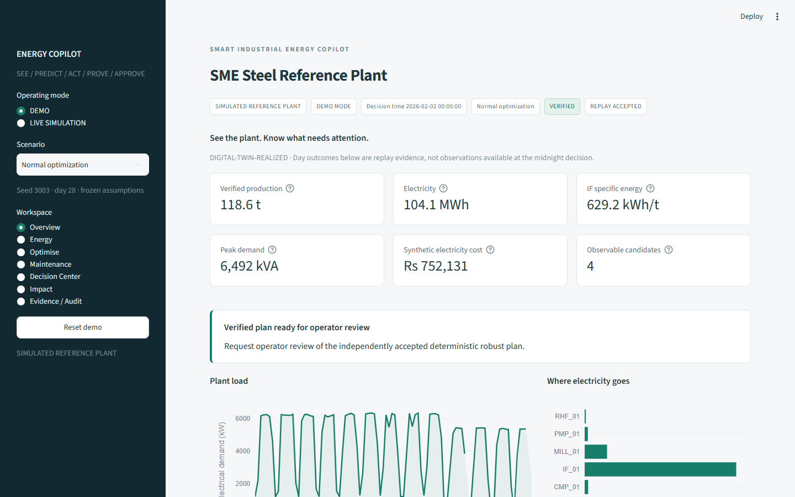
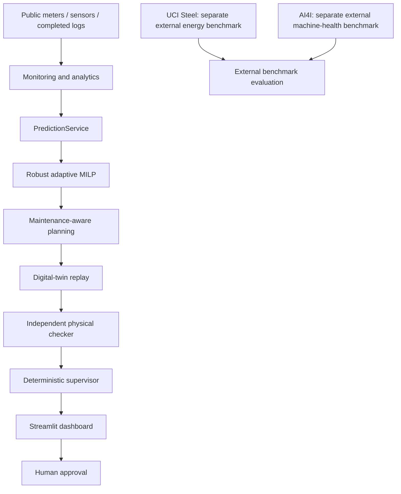
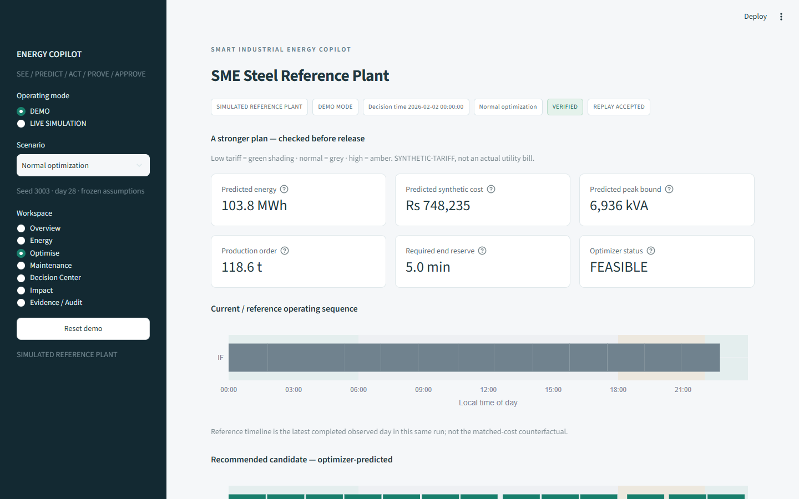
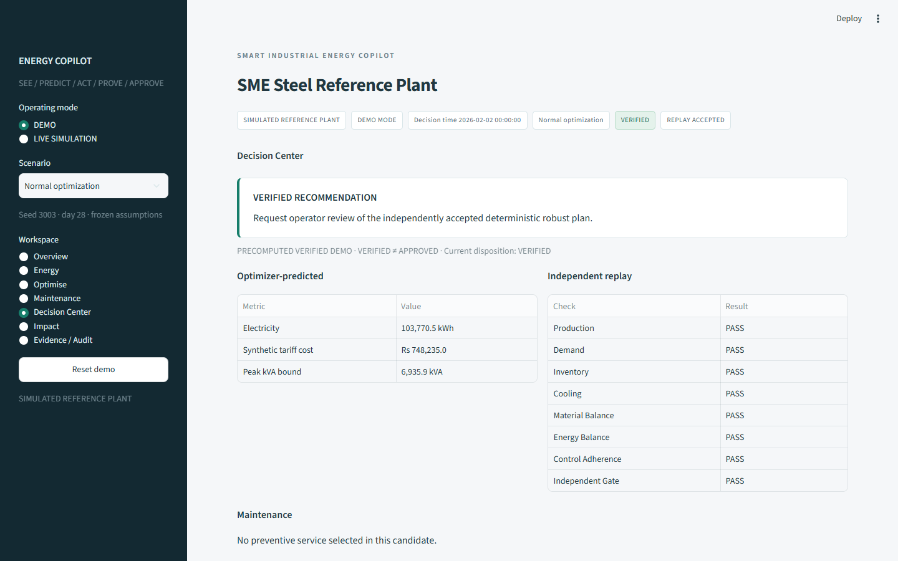
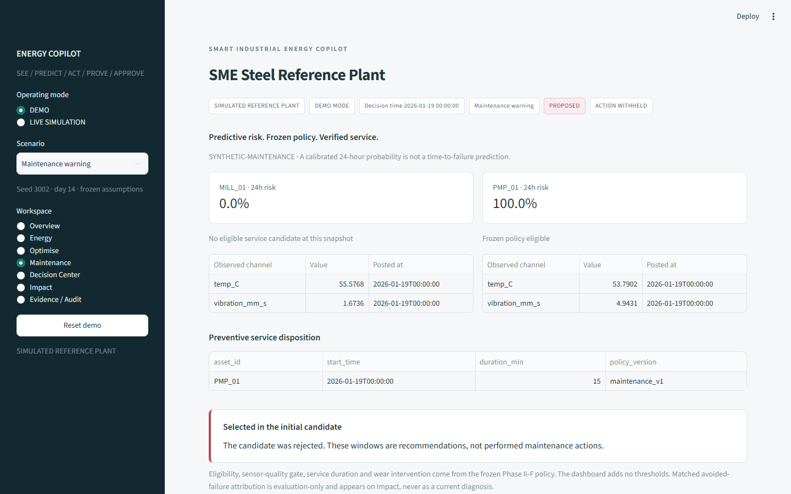

# Smart Industrial Energy Copilot

A digital-twin-backed industrial energy decision-support system that predicts plant behaviour, optimizes production and maintenance schedules, independently verifies recommendations through physical replay, and presents checked decisions to the operator.

**ML predicts. MILP decides. Digital twin verifies. Human approves.**



## What it does

The deterministic v1.0 prototype helps an operator **see** plant condition, **predict** energy/duration/load/health, **plan** robust schedules, **prove** them through independent replay, and **approve** verified recommendations. It withholds failed plans. A live LLM is not required.

## Why this problem matters

An SME steel plant must meet production while managing furnace electricity, thermal processes, stock, utilities and equipment availability. Cheaper tariff windows do not necessarily reduce energy; a mathematically feasible forecast schedule may still fail under physical replay. This project makes both distinctions visible.

## System architecture



## Reference plant

SIMULATED SME steel reference plant: induction furnace → caster → billet yard → reheating furnace → rolling mill, supported by cooling pump, compressor and AUX. The shared clock is 15 minutes; hard constraints include 7,000 kVA contract demand, 0–200 t stock, process yields and cooling interlock. Technical values and assumptions remain versioned in [plant_v1.yaml](configs/plant_v1.yaml) and the [assumption register](reports/assumption_register.md).

## Key capabilities

- Time-aware monitoring, heat/asset accounting and observable diagnostics.
- Independent energy, duration, AUX-load and machine-health predictors.
- Robust/adaptive MILP scheduling and bounded synthetic preventive maintenance.
- Matched-condition replay and independent acceptance gates.
- Provenance-backed operator recommendations, explicit approval and retained rejection evidence.

## Key results

These are **reduced-order simulation results**, not field savings or industrial reliability evidence.

| Purpose | Frozen evidence | Interpretation |
|---|---|---|
| Energy / tariff example | ~2.44% lower simulated electricity; ~4.21% lower synthetic tariff cost; production maintained | DIGITAL-TWIN-REALIZED, SYNTHETIC-PRACTICE, SYNTHETIC-TARIFF; [Phase II-D](reports/phase2d_replay_summary.md) |
| Robust scheduling | Original central scheduler 0/10 feasible; robust adaptive scheduler 10/10 | Held-out digital-twin evaluation, not a safety guarantee; [Phase II-E](reports/phase2e_summary.md) |
| Maintenance | 16 services; 14 strict matched avoided failures; 0 unnecessary within 24 h; 2 undetermined | SYNTHETIC-MAINTENANCE; final F0 feasibility **91.67%**, F2 **87.50%**; [Phase II-F](reports/phase2f_summary.md) |
| Supervisor | 81 scripted deterministic cases; 100% expected safe handling; 0 false verified recommendations | G0 qualified offline; live LLM evaluation is pending and not required for v1; [Phase II-G](reports/phase2g_summary.md) |

Maintenance reduced represented equipment failures but did **not** improve final scheduling feasibility. Heat-duration/scheduling limitations remain. Unlike benefits are reported separately. Exact deck metrics and their source hashes are in [dashboard_deck_metrics.json](dashboard_deck_metrics.json).

## Demo

Default **DEMO MODE** loads frozen, labelled precomputed evidence without training, internet or API keys. Seven pages: Overview, Energy, Optimise, Maintenance, Decision Center, Impact, Evidence / Audit. Four coherent cases: normal optimization, maintenance warning, replay rejection, adaptive recovery. VERIFIED is not APPROVED; failed plans cannot be approved.







Three-minute path: **Overview → Energy → Optimise → Replay rejection → Adaptive recovery / Decision Center → Maintenance → Impact**. [Demo script](reports/phase3a_demo_script.md). Live simulation is an explicit, heavier action and requires the complete qualified scientific archive; the lightweight checkout is optimized for offline Demo Mode. [Details](docs/REPRODUCIBILITY.md).

## Quick start

Use Python **3.12**. Run from the repository root:

```sh
git clone https://github.com/preyash309/smart-industrial-energy-copilot.git
cd smart-industrial-energy-copilot
python -m venv .venv
# Windows PowerShell: .venv\Scripts\Activate.ps1
# Linux/macOS: source .venv/bin/activate
python -m pip install -r requirements-demo.txt
python scripts/verify_release.py
python -m streamlit run dashboard/app.py
```

Open the localhost URL printed by Streamlit. Default startup is Demo Mode. **No real machinery control, authentication or live LLM is included.**

## Repository structure

```text
configs/                    versioned plant, model, scheduling and supervisor contracts
src/energy_copilot/          sim, analytics, forecast, optimization, replay, robust,
                            maintenance, supervisor, dashboard
dashboard/                  Streamlit pages and immutable evidence bundles
models/phase2b_v1/           frozen inference artifacts / contracts
scripts/                    stage commands and release verification
tests/                      original scientific tests and demo/UI tests
docs/                       permanent architecture, data, methods and limitations
reports/                    final scientific summaries and release audits
examples/                   minimal public demo API use
replay/, supervision/       small cited evidence / audit closure
data/processed/             selected data cards and schemas
```

## Technical pipeline

[Architecture](docs/ARCHITECTURE.md) describes the typed interfaces and information boundary. [Experiment index](docs/EXPERIMENT_INDEX.md) maps phases to final evidence. Physical truth is generated before independent sensor observations; hidden health, future events and evaluation labels are not predictors or supervisor inputs.

## Data and models

The integrated reference plant is simulated. UCI Steel and AI4I are **separate external benchmarks**, never reference-plant measurements. Public download/attribution and corpus retention are documented in [DATA.md](docs/DATA.md). Frozen model artifacts are included for reproducibility; only load trusted joblib artifacts. No credentials are required for the demo.

## Reproducibility

The public profile retains byte-identical scientific source, versioned configs, original tests, selected inference artifacts, final reports and coherent demo evidence. Multi-run corpora, latent tables and bulk replay logs remain in the full scientific archive. [REPRODUCIBILITY.md](docs/REPRODUCIBILITY.md) explicitly separates lightweight CI/demo verification from complete historical scientific reproduction. Packaging provenance is in [phase4_public_profile.json](reports/phase4_public_profile.json).

## Tests

```sh
python -m pip install -r requirements-dev.txt
python scripts/verify_release.py --tests
```

The scientific archive pre-release regression was **492 passed, 1 skipped** (UI packages deliberately isolated); separate dashboard tests passed. Final release and clean-checkout results are recorded in [release audit](reports/phase4_release_audit.md). CI runs the documented lightweight subset without APIs or retraining; it does not claim to reproduce every archived experiment.

## Limitations

Reduced-order physics; synthetic practice/tariff/maintenance; small evaluation populations; 24-hour health model; duration uncertainty; no field calibration, real tariff billing, service cost or industrial maintenance ROI. Failed plans remain evidence. [Results and limitations](docs/RESULTS_AND_LIMITATIONS.md).

## Deployment pathway

v1.0 is local simulation and decision support. Plant validation, secure ingestion, authentication/RBAC, isolation, real tariffs and operator trials are future work. [Deployment boundary](docs/DEPLOYMENT_BOUNDARY.md).

## License / citation

Project license is **pending owner selection**; public visibility does not grant an open-source license. Public datasets have their own CC BY 4.0 terms. Supplied challenge PDFs are retained in the research archive and not redistributed here. Cite the repository/version and linked evidence; no affiliation is implied.
